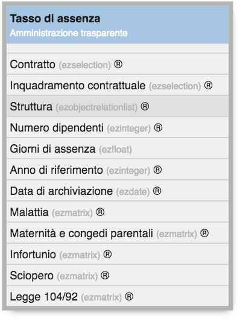
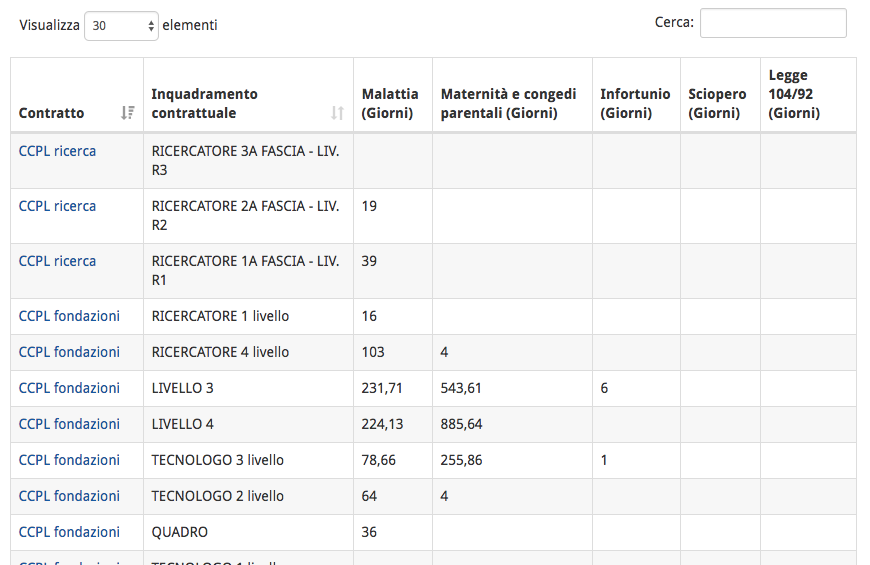
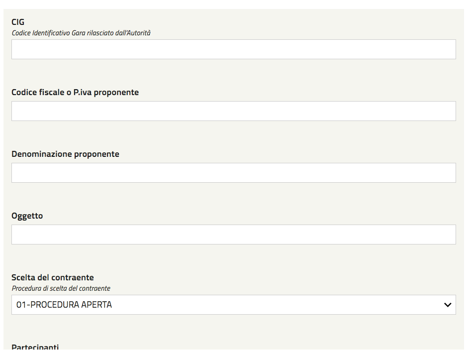
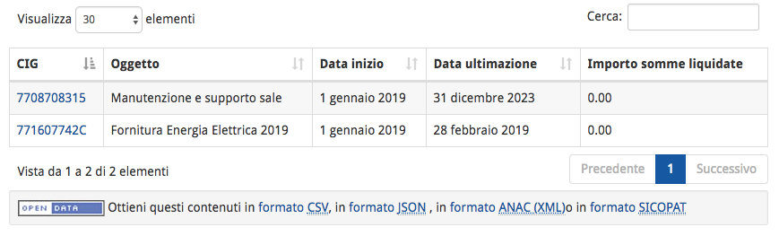

.. _h347139506d11663623a38354aa713e:

Manuale OpenTrasparenza
***********************

OpenTrasparenza è uno strumento web che consente di mantenere in ordine la sezione \ |STYLE0|\  del sito di un ente,  grazie alle interfacce intuitive e a diversi controlli automatici a disposizione dei redattori.

RIproduce una struttura ad albero basata sulla \ |STYLE1|\  (\ |LINK1|\ ), 

\ |IMG1|\ 

.. _h7e6a4e623655344c714e3a3334713:

Strutturazione dei dati
=======================

Basato sui principi della piattaform OpenPA, OpenTrasparenza ha un forte orientamento alla strutturazione dei dati, che consente estrazioni automatiche delle informazioni (ad esempio per l’invio periodico dei dati ad ANAC).

I contenuti sono gestiti con le cosiddette “classi di contenuto”. Si tratta di \ |STYLE2|\ .

Ad esempio, se un editor deve inserire i tassi di assenza del personale sul sito web dell’ente, utilizzerà la classe “tasso di assenza”.

\ |IMG2|\ 

\ |STYLE3|\ 

Una volta inseriti i contenuti adeguatamente strutturati, è possibile avere delle rappresentazioni tabellari, con filtri e motore di ricerca specifico.

\ |IMG3|\ 

\ |STYLE4|\ 

.. _h2d37d5941406c5d385c664c53476215:

Inserimento dei contenuti
=========================

Un utente amministratore ha la facoltà di creare gli utenti “editor” che hanno la facoltà di inserire  e modificare i contenuti nella sezione Amministrazione trasparente.

Una volta effettuato l’accesso al sistema, gli editor navigano il sito verso il sottoalbero della sezione Amministrazione Trasparente dove devono inserire i contenuti. Attraverso l’utilizzo della barra degli strumenti inseriscono i contenuti adeguati al sottoalbero dove si trovano.

Ad esempio possono inserire oggetti di tipo “Lotto” nella sezione “Bandi di Gara e Contratti”, selezionando “Lotto” (1) e poi cliccando il pulsante “crea qui” (2).

\ |IMG4|\ 

Viene presentata l’interfaccia di inserimento di un nuovo contenuto:

\ |IMG5|\ 

Inserendo tutte le informazioni relative al singolo lotto, è poi possibile visualizzarle in forma tabellare:

\ |IMG6|\ 

Tali informazioni sono esportabili in vari formati (ad esempio il formato XML compatibile con ANAC).

.. _h133b72d970104a5f7c5c7e325f5869:

Importazione di contenuti
=========================

Inserire ogni singola informazione manualmente può rivelarsi oneroso in termini di tempo. Per questo, OpenTrasparenza permette anche di effettuare dei caricamenti massivi di contenuti da file csv, ove questi possono essere estratti da sistemi in esercizio nell’ente. In questo modo, il caricamento e l’aggiornamento di grandi moli di dati diventa piuttosto semplice. Il file csv deve seguire determinare regole per poter essere importato nel sistema.

.. bottom of content

.. |STYLE0| replace:: **"Amministrazione Trasparente"**

.. |STYLE1| replace:: **Bussola della Trasparenza**

.. |STYLE2| replace:: **strutture dati predefinite che rappresentazione diverse tipologie di contenuto**

.. |STYLE3| replace:: *La Classe “Tasso di assenza” con i suoi attributi.*

.. |STYLE4| replace:: *I tassi di assenza in visualizzazione tabellare.*

.. |LINK1| raw:: html

    <a href="http://bussola.magellanopa.it/home.html" target="_blank">http://bussola.magellanopa.it/home.html</a>

.. |IMG1| image:: static/Index_1.png
   :height: 382 px
   :width: 205 px

