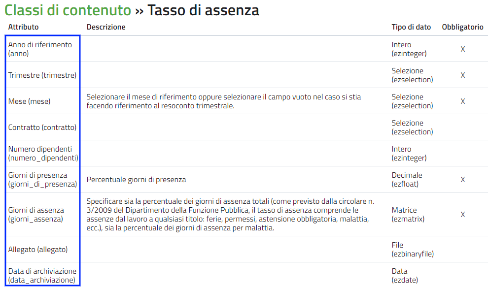
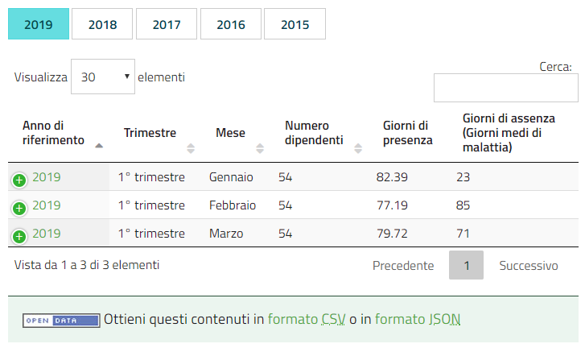
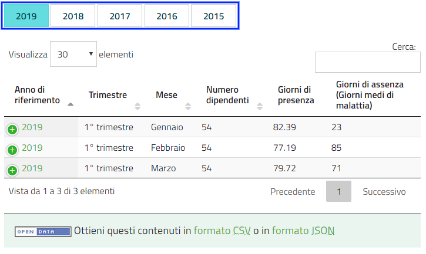
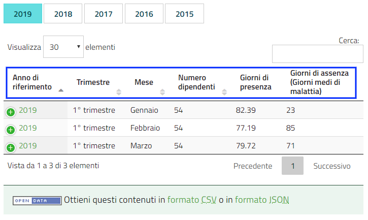
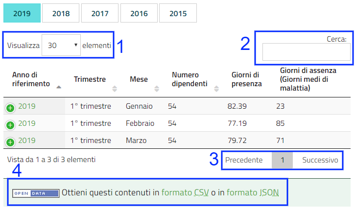

.. _h7f471331411c7752326c585f29141348:

Funzionalità di OpenTrasparenza
*******************************

.. _h7e6a4e623655344c714e3a3334713:

Strutturazione dei dati
=======================

Basato sui principi della piattaforma \ |LINK1|\ , \ |LINK2|\  ha un forte orientamento alla \ |STYLE0|\ , che consente estrazioni automatiche delle informazioni (ad esempio per l’invio periodico dei dati ad ANAC).

I contenuti sono gestiti con le cosiddette \ |LINK3|\ . Si tratta di \ |STYLE1|\ .

Ad esempio, se un editor deve inserire i tassi di assenza del personale sul sito web dell’ente, utilizzerà la classe \ |STYLE2|\ .

\ |IMG1|\ 

\ |STYLE3|\ 

.. _h041f2e125e3e1e4471177451d4f65:

Importazione massiva di contenuti
=================================

OpenTrasparenza dà la possibilità di caricare dati, strutturati in fogli di calcolo, attraverso un \ |STYLE4|\ , in modo da risparmiare il tempo del caricamento manuale. 

Inserire ogni singola informazione manualmente infatti può rivelarsi oneroso in termini di tempo. 

Che tipi di dati possono essere importati?

In generale tutti i dati che alcuni sistemi di gestione permettono di esportare.

Anche nel caso di dati disponibili in file pdf, si può risalire al formato elettronico tabellare con strumenti come questo: \ |LINK4|\  

I dati possono essere caricati massivamente all’interno di OpenTrasparenza attraverso \ |STYLE5|\  o, in alcuni casi, se disponibile la funzionalità, attraverso i \ |STYLE6|\  di Google. 

Il dati devono inoltre essere strutturati secondo determinate regole per poter essere importati all’interno del sistema.

Grazie a questa funzionalità, il caricamento e l’aggiornamento di grandi moli di dati diventa piuttosto semplice.

.. _h7c4a1a5531554d3a3a47383664207859:

Visualizzazione tabellare
=========================

OpenTrasparenza supporta la visualizzazione tabellare. 

\ |IMG2|\ 

\ |STYLE7|\ 

Questo significa che, una volta inseriti i contenuti adeguatamente strutturati - cioè utilizzando la \ |STYLE8|\  specifica -, è possibile rappresentare i contenuti in formato tabellare, con filtri e motore di ricerca specifico.

Tali informazioni sono inoltre  esportabili in vari formati (ad esempio il formato XML compatibile con ANAC).

Per esempio, è possibile filtrare i contenuti per anno (se il campo denominato \ |STYLE9|\  è presente ed è stato adeguatamente compilato).

\ |IMG3|\ \ |STYLE10|\ 

Oppure, è possibile modificare le colonne che si desiderano mostrare sulla tabella (omettendone alcune o aggiungendone altre).

\ |IMG4|\ 

\ |STYLE11|\ 

Allo stesso tempo, l’utente invece è facilitato nella consultazione dei contenuti grazie alle seguenti funzionalità:

* Modifica del numero di elementi da visualizzare per pagina (1)

* Ricerca attraverso un motore di ricerca interno alla pagina (2),

* Scorrimento tra le pagine di visualizzazione (3)

* Esportazione dei contenuti in formato CSV o in formato JSON (4)

\ |IMG5|\ 

.. _h2878256a793dd584a14e7776663c4a:

Classi di contenuto
===================

In totale, nel sistema dedicato all’Amministrazione Trasparente sono presenti circa 20 classi di contenuto dedicate.

A titolo esemplificativo, vengono elencate sotto alcune delle più rilevanti classi di contenuto che interessano la sezione Amministrazione trasparente, suddivise per tipologia:

+---------------------------+------------------------------------------------------------------------------------------------------------------------------------------------------------------------------------------------------------------------------------------------------------------------------------------------------------------------------------------------------------------------------------------------------------------+
|Amministrazione trasparente|Accesso, Attestazione OIV, Bilancio consuntivo, Bilancio preventivo, Circolare, Conferimento incarico, Consulenza o collaborazione, Conto annuale, Immobile, Indicatori tempestività pagamenti, Nota trasparenza, Obiettivi accessibilità, Pagamenti, Piano Triennale PCT, Premi di merito, Regolamento, Relazione economica, Rendiconto, Sanzione, Società controllata, Sovvenzione/contributo, Tasso di assenza |
+---------------------------+------------------------------------------------------------------------------------------------------------------------------------------------------------------------------------------------------------------------------------------------------------------------------------------------------------------------------------------------------------------------------------------------------------------+
|\ |STYLE12|\               |Bando di concorso, Bando di gara, Decreto, Deliberazione, Determinazione                                                                                                                                                                                                                                                                                                                                          |
+---------------------------+------------------------------------------------------------------------------------------------------------------------------------------------------------------------------------------------------------------------------------------------------------------------------------------------------------------------------------------------------------------------------------------------------------------+
|\ |STYLE13|\               |Piani e progetti, Documento, Procedimento amministrativo                                                                                                                                                                                                                                                                                                                                                          |
+---------------------------+------------------------------------------------------------------------------------------------------------------------------------------------------------------------------------------------------------------------------------------------------------------------------------------------------------------------------------------------------------------------------------------------------------------+
|\ |STYLE14|\               |Circolare, Disciplinare, Modulistica, Procedura, Utilità                                                                                                                                                                                                                                                                                                                                                          |
+---------------------------+------------------------------------------------------------------------------------------------------------------------------------------------------------------------------------------------------------------------------------------------------------------------------------------------------------------------------------------------------------------------------------------------------------------+
|\ |STYLE15|\               |File, Image, Link                                                                                                                                                                                                                                                                                                                                                                                                 |
+---------------------------+------------------------------------------------------------------------------------------------------------------------------------------------------------------------------------------------------------------------------------------------------------------------------------------------------------------------------------------------------------------------------------------------------------------+
|\ |STYLE16|\               |Area, Organigramma, Ruolo, Servizio, Struttura, Ufficio                                                                                                                                                                                                                                                                                                                                                           |
+---------------------------+------------------------------------------------------------------------------------------------------------------------------------------------------------------------------------------------------------------------------------------------------------------------------------------------------------------------------------------------------------------------------------------------------------------+
|\ |STYLE17|\               |Politico, Consigliere                                                                                                                                                                                                                                                                                                                                                                                             |
+---------------------------+------------------------------------------------------------------------------------------------------------------------------------------------------------------------------------------------------------------------------------------------------------------------------------------------------------------------------------------------------------------------------------------------------------------+
|\ |STYLE18|\               |Dipendente, User                                                                                                                                                                                                                                                                                                                                                                                                  |
+---------------------------+------------------------------------------------------------------------------------------------------------------------------------------------------------------------------------------------------------------------------------------------------------------------------------------------------------------------------------------------------------------------------------------------------------------+

.. _h2c1d74277104e41780968148427e:

.. bottom of content

.. |STYLE0| replace:: **strutturazione dei dati**

.. |STYLE1| replace:: **strutture dati predefinite che rappresentano diverse tipologie di contenuto**

.. |STYLE2| replace:: **Tasso di assenza**

.. |STYLE3| replace:: *La Classe “Tasso di assenza” con i suoi attributi.*

.. |STYLE4| replace:: **importazione massiva dei contenuti**

.. |STYLE5| replace:: **file csv**

.. |STYLE6| replace:: **Fogli di lavoro**

.. |STYLE7| replace:: *I tassi di assenza in visualizzazione tabellare.*

.. |STYLE8| replace:: **classe di contenuto**

.. |STYLE9| replace:: **anno**

.. |STYLE10| replace:: *I tassi di assenza con il filtro “anno” attivato.*

.. |STYLE11| replace:: *La visualizzazione tabellare deI tassi di assenza mostra alcuni attributi ma ne omette altri.*

.. |STYLE12| replace:: **Albo**

.. |STYLE13| replace:: **Comune**

.. |STYLE14| replace:: **Intranet**

.. |STYLE15| replace:: **Media**

.. |STYLE16| replace:: **Organizzazione**

.. |STYLE17| replace:: **Politica**

.. |STYLE18| replace:: **Users**

.. |LINK1| raw:: html

    <a href="https://www.opencontent.it/Per-la-PA" target="_blank">OpenPA</a>

.. |LINK2| raw:: html

    <a href="https://www.opencontent.it/Per-la-PA/OpenTrasparenza" target="_blank">OpenTrasparenza</a>

.. |LINK3| raw:: html

    <a href="#heading=h.g9446dz45ile">classi di contenuto</a>

.. |LINK4| raw:: html

    <a href="https://smallpdf.com/it/pdf-in-excel" target="_blank">https://smallpdf.com/it/pdf-in-excel</a>

