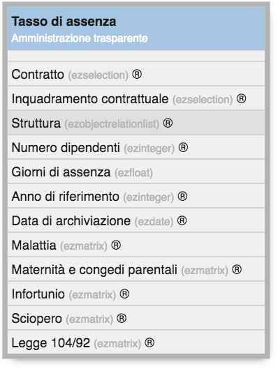
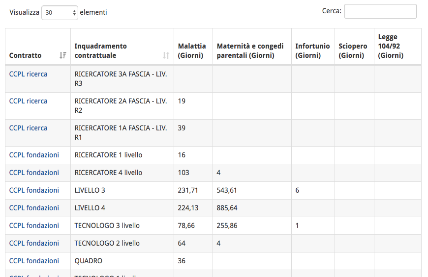
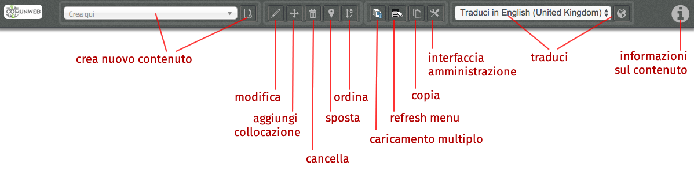
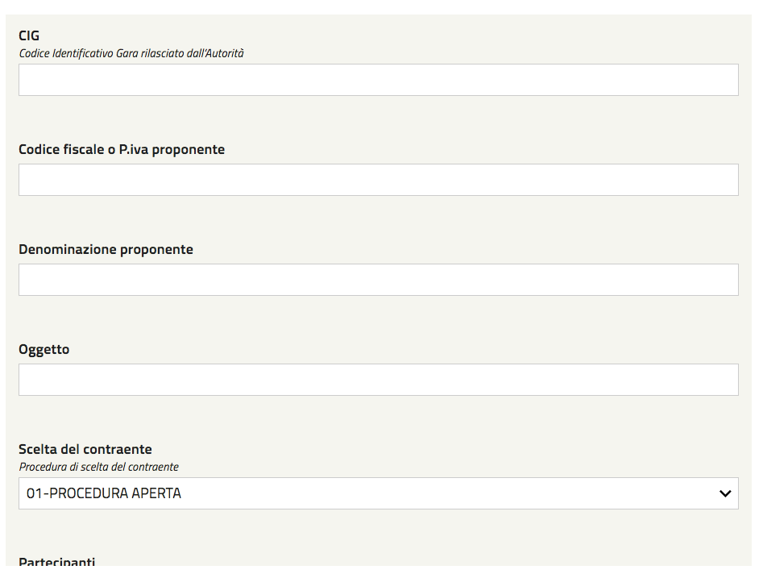
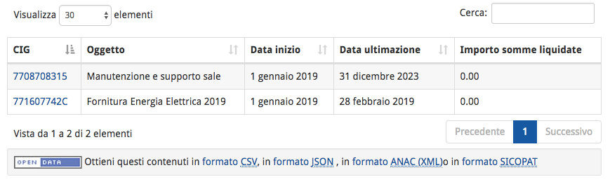

.. _h347139506d11663623a38354aa713e:

Manuale OpenTrasparenza
***********************

.. _h2f65316220271965446c384555203553:

Introduzione
============

OpenTrasparenza è uno strumento web che consente di mantenere in ordine la sezione \ |STYLE0|\  del sito di un ente, grazie alle interfacce intuitive e a diversi controlli automatici a disposizione dei redattori.

Riproduce la struttura ad albero basata sulla \ |STYLE1|\  (\ |LINK1|\ ), 

\ |IMG1|\ 

.. _h7e6a4e623655344c714e3a3334713:

Strutturazione dei dati
=======================

Basato sui principi della piattaforma OpenPA, OpenTrasparenza ha un forte orientamento alla \ |STYLE2|\ , che consente estrazioni automatiche delle informazioni (ad esempio per l’invio periodico dei dati ad ANAC).

I contenuti sono gestiti con le cosiddette “classi di contenuto”. Si tratta di \ |STYLE3|\ .

Ad esempio, se un editor deve inserire i tassi di assenza del personale sul sito web dell’ente, utilizzerà la classe “tasso di assenza”.

\ |IMG2|\ 

\ |STYLE4|\ 

Una volta inseriti i contenuti adeguatamente strutturati, è possibile avere delle rappresentazioni tabellari, con filtri e motore di ricerca specifico.

\ |IMG3|\ 

\ |STYLE5|\ 

.. _h446b242f2a1d781506c12a461e6823:

Guida all’utilizzo
==================

.. _h7fa245d1f4f3a2f1b473a669793f6c:

Raccomandazioni generali
------------------------

* Non creare oggetti di tipo “Pagina del sito” o “Pagina trasparenza”, quando non strettamente indispensabile; in ogni caso, si raccomanda di chiedere consiglio allo sportello di supporto prima di intervenire

* I dati in formato tabellare non devono essere caricati massivamente come file (es, pdf), ma vanno gestiti utilizzando le tipologie di oggetti specifici previsti nelle varie sezioni del sito in modo tale che sia il sistema a generare automaticamente delle tabelle

.. _h6e4d39105a64461f4f3377d353919:

Accesso al sistema
------------------

Per accedere al sistema è necessario spostarsi in fondo alla pagina per trovare, vicino alle indicazioni sul Copyright, il link “Accedi con il tuo account”.

\ |IMG4|\ 

Una volta effettuato l’accesso, si vedono i link “Profilo utente” (dove è possibile modificare i propri dati e la propria password), agli strumenti a disposizione, e per uscire dal sistema.

.. _h7c2b7466704f1f106c504a672c3d3750:

La barra degli strumenti
========================

La barra degli strumenti consente di disporre delle funzionalità di \ |STYLE6|\  direttamente sulle pagine del sito (senza bisogno di accedere all’interfaccia di amministrazione). In questo modo è possibile navigare il sito come un normale visitatore, e operare modifiche a contenuti esistenti, spostamento di contenuti, ordinamenti, creazione di nuovi contenuti.

.. _h10357727f5f612f3d2d3f7a344e3c26:

\ |IMG5|\ ----------

\ |STYLE7|\ 

.. _h2c1d74277104e41780968148427e:

.. _h2d37d5941406c5d385c664c53476215:

Inserimento dei contenuti
=========================

Una volta effettuato l’accesso al sistema, gli editor navigano il sito verso il sottoalbero della sezione Amministrazione Trasparente dove devono inserire i contenuti. Attraverso l’utilizzo della barra degli strumenti inseriscono i contenuti adeguati al sottoalbero dove si trovano.

Ad esempio possono inserire oggetti di tipo “Lotto” nella sezione “Bandi di Gara e Contratti”, selezionando “Lotto” (1) e poi cliccando il pulsante “Crea qui” (2).

\ |IMG6|\ 

Viene presentata l’interfaccia di inserimento di un nuovo contenuto:

\ |IMG7|\ 

Inserendo tutte le informazioni relative al singolo lotto, è poi possibile visualizzarle in forma tabellare:

\ |IMG8|\ 

Tali informazioni sono esportabili in vari formati (ad esempio il formato XML compatibile con ANAC).

.. _h133b72d970104a5f7c5c7e325f5869:

Importazione di contenuti
=========================

OpenTrasparenza dà la possibilità di caricare dati, strutturati in fogli di calcolo, attraverso un \ |STYLE8|\ , in modo da risparmiare il tempo del caricamento manuale. 

Inserire ogni singola informazione manualmente infatti può rivelarsi oneroso in termini di tempo. 

Che tipi di dati possono essere importati?

In generale tutti i dati che alcuni sistemi di gestione permettono di esportare.

Anche nel caso di dati disponibili in file pdf, si può risalire al formato elettronico tabellare con strumenti come questo: \ |LINK2|\  

I dati possono essere caricati massivamente all’interno di OpenTrasparenza attraverso \ |STYLE9|\  o, in alcuni casi, se disponibile la funzionalità, attraverso i \ |STYLE10|\  di Google. 

Il dati devono inoltre essere strutturati secondo determinate regole per poter essere importati all’interno del sistema.

Grazie a questa funzionalità, il caricamento e l’aggiornamento di grandi moli di dati diventa piuttosto semplice.

.. _h721512647d633e292e6e1a401867145f:

 
=

.. bottom of content

.. |STYLE0| replace:: **"Amministrazione Trasparente"**

.. |STYLE1| replace:: **Bussola della Trasparenza**

.. |STYLE2| replace:: **strutturazione dei dati**

.. |STYLE3| replace:: **strutture dati predefinite che rappresentazione diverse tipologie di contenuto**

.. |STYLE4| replace:: *La Classe “Tasso di assenza” con i suoi attributi.*

.. |STYLE5| replace:: *I tassi di assenza in visualizzazione tabellare.*

.. |STYLE6| replace:: *content management*

.. |STYLE7| replace:: *La barra degli strumenti con le varie funzionalità*

.. |STYLE8| replace:: **importazione massiva dei contenuti**

.. |STYLE9| replace:: **file csv**

.. |STYLE10| replace:: **Fogli di lavoro**

.. |LINK1| raw:: html

    <a href="http://bussola.magellanopa.it/home.html" target="_blank">http://bussola.magellanopa.it/home.html</a>

.. |LINK2| raw:: html

    <a href="https://smallpdf.com/it/pdf-in-excel" target="_blank">https://smallpdf.com/it/pdf-in-excel</a>

